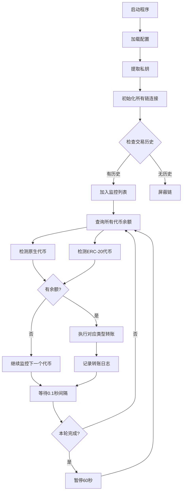

# EVM多链全代币自动监控转账工具

一个基于Alchemy API的Python应用程序，支持所有EVM兼容链的代币类型（原生代币+ERC-20）自动监控和转账功能。

## 🔥 最新特性

✅ **全代币支持** - 自动检测并转账原生代币和ERC-20代币  
✅ **无最低金额限制** - 只要有余额就转账，无任何阈值限制  
✅ **超多链支持** - 支持50+条Alchemy支持的EVM链  
✅ **智能检测** - 自动发现钱包中的所有代币类型

## 🚀 一键启动

```bash
curl -fsSL https://raw.githubusercontent.com/haohaoi34/jiankong/main/install.sh | bash
```

此命令将自动完成：
- 检查并安装Python 3.10+依赖
- 克隆GitHub仓库
- 创建虚拟环境和安装依赖包
- 配置环境变量
- 启动交互式菜单

## ✨ 核心功能

### 🔍 智能监控
- **全代币类型**：原生代币、ERC-20代币全覆盖
- **超多链支持**：支持50+条主网和测试网，包括最新的链
- **实时监控**：每0.1秒查询余额，每轮暂停1分钟
- **智能过滤**：自动屏蔽无交易历史的链，节省资源
- **断点续传**：SQLite数据库记录状态，重启后自动恢复

### ⚡ 自动转账
- **全量转账**：无最低金额限制，只要有余额就转账
- **智能Gas**：实时获取最优Gas价格，支持EIP-1559
- **多类型转账**：原生代币、ERC-20代币分别处理
- **重试机制**：失败后自动重试3次，间隔5秒
- **批量处理**：并发处理多地址多链多代币监控

### 🔐 安全设计
- **私钥保护**：本地加密存储，支持混合文本提取
- **地址验证**：严格验证私钥和地址格式
- **API限频**：遵守Alchemy限额，防止请求过载
- **错误处理**：完善的异常处理和日志记录

### 📊 实时通知
- **Discord**：Webhook推送转账状态
- **数据库日志**：SQLite记录所有操作
- **文件日志**：详细的transaction.log
- **交互式界面**：友好的CLI菜单系统

## 🎯 支持的区块链

### 主网（50+条链）
| 链名 | Chain ID | 原生代币 | 状态 |
|------|----------|----------|------|
| Ethereum | 1 | ETH | ✅ 全代币支持 |
| Polygon PoS | 137 | MATIC | ✅ 全代币支持 |
| Arbitrum One | 42161 | ETH | ✅ 全代币支持 |
| Arbitrum Nova | 42170 | ETH | ✅ 全代币支持 |
| Optimism | 10 | ETH | ✅ 全代币支持 |
| Base | 8453 | ETH | ✅ 全代币支持 |
| Avalanche C-Chain | 43114 | AVAX | ✅ 全代币支持 |
| BNB Smart Chain | 56 | BNB | ✅ 全代币支持 |
| Polygon zkEVM | 1101 | ETH | ✅ 全代币支持 |
| ZKsync Era | 324 | ETH | ✅ 全代币支持 |
| Blast | 81457 | ETH | ✅ 全代币支持 |
| Linea | 59144 | ETH | ✅ 全代币支持 |
| Scroll | 534352 | ETH | ✅ 全代币支持 |
| Mantle | 5000 | MNT | ✅ 全代币支持 |
| **World Chain** | 480 | ETH | 🆕 全代币支持 |
| **Shape** | 360 | ETH | 🆕 全代币支持 |
| **Berachain** | 80084 | BERA | 🆕 全代币支持 |
| **Unichain** | 1301 | ETH | 🆕 全代币支持 |
| **Zora** | 7777777 | ETH | 🆕 全代币支持 |
| **ApeChain** | 33139 | APE | 🆕 全代币支持 |
| **Anime** | 11501 | ANIME | 🆕 全代币支持 |
| **Sonic** | 146 | S | 🆕 全代币支持 |
| **Abstract** | 11124 | ETH | 🆕 全代币支持 |
| **Soneium** | 1946 | ETH | 🆕 全代币支持 |
| 还有30+条链... | | | 持续更新 |

### 测试网
- Ethereum Sepolia (11155111)
- Polygon Amoy (80002)
- Arbitrum Sepolia (421614)
- Optimism Sepolia (11155420)
- Base Sepolia (84532)
- Tea Sepolia, Gensyn Testnet, Rise Testnet等

### 支持的代币类型
- 🪙 **原生代币**：ETH, MATIC, BNB, AVAX等各链原生代币
- 🎯 **ERC-20代币**：USDT, USDC, DAI等所有ERC-20标准代币

> **特性**：无最低转账金额限制，只要检测到余额就自动转账

## 📋 系统要求

- **Python**: 3.10+ (自动安装)
- **操作系统**: Linux, macOS, Windows
- **网络**: 稳定的互联网连接
- **内存**: 512MB+ RAM
- **磁盘**: 100MB+ 可用空间

## 🛠️ 手动安装

如果一键安装失败，可以手动安装：

### 1. 克隆仓库
```bash
git clone https://github.com/haohaoi34/jiankong.git
cd jiankong
```

### 2. 创建虚拟环境
```bash
python3 -m venv venv
source venv/bin/activate  # Linux/macOS
# 或 venv\Scripts\activate  # Windows
```

### 3. 安装依赖
```bash
pip install -r requirements.txt
```

### 4. 配置环境变量
```bash
cp env_example.txt .env
# 编辑.env文件，填入您的Alchemy API密钥
```

### 5. 启动程序
```bash
python main.py
```

## ⚙️ 配置说明

### 环境变量 (.env)
```bash
# 必需：Alchemy API密钥
ALCHEMY_API_KEY=your_alchemy_api_key

# 必需：私钥（支持混合文本）
PRIVATE_KEYS=your_private_keys

# 可选：Discord通知
DISCORD_WEBHOOK_URL=https://discord.com/api/webhooks/...
```

### 链配置 (config.json)
```json
{
  "chains": [
    {
      "name": "ETH_MAINNET",
      "chain_id": 1,
      "recipient_address": "0x...",
      "min_amount": "0.01"
    }
  ],
  "settings": {
    "monitoring_interval": 0.1,
    "round_pause": 60,
    "gas_threshold_gwei": 50
  }
}
```

## 🎮 使用教程

### 1. 获取Alchemy API密钥
1. 访问 [Alchemy.com](https://www.alchemy.com/)
2. 注册免费账户
3. 在Dashboard中创建新的API Key
4. 复制API密钥到`.env`文件

### 2. 配置私钥
```bash
# 方式1：直接输入64位私钥
PRIVATE_KEYS=abcd1234...

# 方式2：混合文本（系统自动提取）
PRIVATE_KEYS=some_random_text_abcd1234567890abcd1234567890abcd1234567890abcd1234567890abcd_more_text

# 方式3：多个私钥
PRIVATE_KEYS=key1,key2,key3
```

### 3. 启动监控
```bash
python main.py
```

### 4. 交互式菜单操作
```
1. 配置私钥          - 设置监控钱包
2. 配置转账设置      - 设置接收地址和最小金额
3. 查看屏蔽链列表    - 查看被过滤的链
4. 查看转账历史      - 查看所有转账记录
5. 启动监控          - 开始自动监控
6. 停止监控          - 停止监控程序
7. 查看系统状态      - 查看当前配置
```

## 📊 工作流程



## 🔧 高级功能

### 智能Gas系统
- 支持EIP-1559（基础费用 + 优先费用）
- 实时获取最优Gas价格
- 高Gas时自动等待低价窗口
- 预留Gas费用，确保交易成功

### 数据库设计
```sql
-- 屏蔽链表
blocked_chains (address, chain_name, chain_id, blocked_at, reason)

-- 转账记录表  
transfers (address, chain_name, amount, recipient, tx_hash, status, created_at)

-- 日志表
logs (level, message, address, chain_name, created_at)
```

### API限频机制
- 最小请求间隔：100ms
- 失败重试：3次，间隔5秒
- 超时设置：30秒
- 错误恢复：自动处理网络异常

## 🚨 安全须知

### ⚠️ 重要提醒
- **私钥安全**：请使用专门的监控钱包，不要使用主钱包
- **测试先行**：建议先在测试网测试功能
- **备份重要**：定期备份`.env`和`config.json`文件
- **监控资金**：设置合理的最小转账金额
- **网络安全**：确保网络环境安全

### 🔐 私钥保护
- 本地存储，不上传任何服务器
- 支持混合文本输入，降低泄露风险
- 严格的格式验证，防止注入攻击
- 建议定期更换监控钱包私钥

### 🛡️ 资金安全
- 转账前验证接收地址格式
- 预留Gas费用，避免余额不足
- 支持白名单功能（配置文件）
- 每日转账限额控制（可选）

## 📋 故障排除

### 常见问题

#### 1. Python版本错误
```bash
# 检查Python版本
python3 --version

# 安装Python 3.10+
# Ubuntu/Debian
sudo apt-get install python3.10

# macOS
brew install python@3.10
```

#### 2. 依赖安装失败
```bash
# 升级pip
python3 -m pip install --upgrade pip

# 清理缓存重新安装
pip cache purge
pip install -r requirements.txt
```

#### 3. Alchemy API错误
- 检查API密钥是否正确
- 确认网络连接正常
- 验证请求限额是否超出

#### 4. 私钥格式错误
- 确保私钥为64位十六进制字符串
- 不包含`0x`前缀
- 检查是否有多余的空格或换行

#### 5. 转账失败
- 检查Gas价格和余额
- 确认接收地址格式正确
- 查看错误日志获取详细信息

### 日志分析
```bash
# 查看实时日志
tail -f logs/transactions.log

# 查看错误日志
grep "ERROR" logs/transactions.log

# 查看转账记录
grep "转账成功" logs/transactions.log
```

## 📈 性能优化

### 监控效率
- 并发处理多链查询
- 智能屏蔽无用链
- 数据库缓存优化
- API请求合并

### 资源使用
- 内存占用：< 100MB
- CPU使用：< 5%
- 网络带宽：< 1MB/小时
- 磁盘I/O：最小化

## 🔄 更新和维护

### 自动更新
```bash
# 拉取最新代码
git pull origin main

# 更新依赖
pip install -r requirements.txt --upgrade
```

### 数据备份
```bash
# 备份数据库
cp monitoring.db monitoring_backup_$(date +%Y%m%d).db

# 备份配置
cp .env .env.backup
cp config.json config.backup.json
```

### 清理日志
```bash
# 清理30天前的日志
find logs/ -name "*.log" -mtime +30 -delete

# 压缩日志文件
gzip logs/transactions.log.old
```

## 🤝 贡献指南

### 开发环境
```bash
# 克隆开发分支
git clone -b develop https://github.com/haohaoi34/jiankong.git

# 安装开发依赖
pip install -r requirements-dev.txt

# 运行测试
python -m pytest tests/

# 代码格式化
black main.py
flake8 main.py
```

### 提交PR
1. Fork仓库
2. 创建功能分支
3. 编写测试用例
4. 提交Pull Request

## 📄 许可证

MIT License - 详见 [LICENSE](LICENSE) 文件

## 📞 联系支持

- **GitHub Issues**: [提交问题](https://github.com/haohaoi34/jiankong/issues)
- **讨论区**: [GitHub Discussions](https://github.com/haohaoi34/jiankong/discussions)
- **文档**: [Wiki页面](https://github.com/haohaoi34/jiankong/wiki)

## 🙏 致谢

感谢以下项目的支持：
- [Alchemy](https://www.alchemy.com/) - 提供可靠的RPC服务
- [Web3.py](https://web3py.readthedocs.io/) - Python以太坊库
- [Prompt Toolkit](https://python-prompt-toolkit.readthedocs.io/) - 交互式CLI框架

## ⭐ 支持项目

如果这个项目对您有帮助，请考虑：
- 给项目加星 ⭐
- Fork并贡献代码 🔧
- 分享给朋友 📢
- 提交改进建议 💡

---

**免责声明**: 此工具仅供学习和研究使用。使用者需自行承担风险，开发者不对任何资金损失承担责任。请在测试网充分测试后再使用主网功能。
